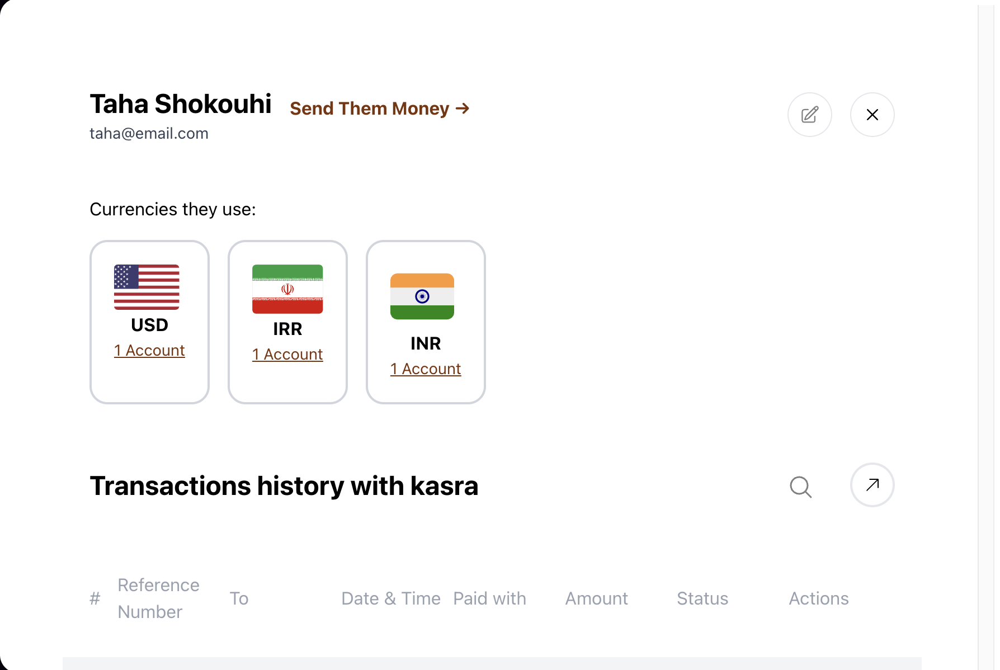
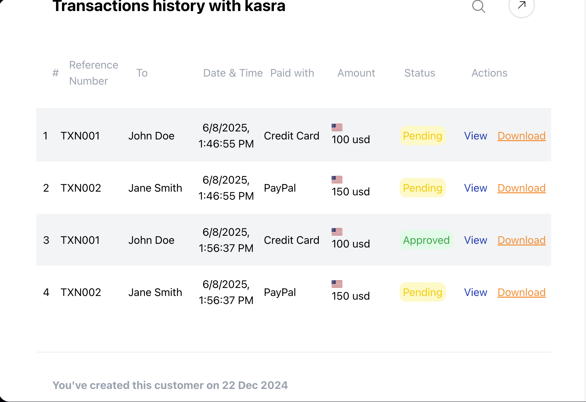

# Hashthink Full-stack Test

This is a full-stack project built for the Hashthink technical assessment. It features a single-page dashboard with React, Nextjs, TailwindCSS, and a NestJS backend.

---

## Screen shots




## 📦 Tech Stack

### Frontend:

- ReactJS
- TailwindCSS
- TypeScript
- State (React state or context API)

### Backend:

- NestJS (Node.js + TypeScript)
- Express
- Optional: Redis, MongoDB/PostgreSQL, Socket.IO, RabbitMQ

---

## 📁 Folder Structure

- `frontend/` — React app with the Receivers dashboard.
- `backend/` — NestJS server with transaction APIs.

---

## 🚀 Getting Started

### 1. Clone the Repo

```bash
git clone https://github.com/codingbymohsen/hashthink.git
cd hashthink-fullstack-test
```

## run mongodb on docker

```
docker compose up -d
```

# run front end

```
npm run dev
```

# run backend

```
npm install
npm run start:dev
```

# seed the mongodb

```
npm run seed:transaction
```
